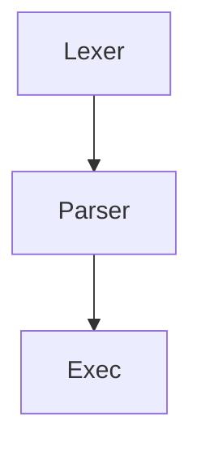

# Projet 42

## Projet du Tronc commun

il faut savoir que les `projet a 42` son basé sur l'apprentisage du **peer to peer** donc je te laisse imaginé que il y'a de ~~professeur~~.
A 42 on utilise [intranet](https://intra.42.fr).
  ****  
Cercle 0 :
- [x] Libft

Cercle 1 :
- [x] GNL
- [x] Printf

Cercle 2 :
- [x] Minitalk
- [x] Fractol
- [x] Push-Swap
- [x] Examen rang 02

Cercle 3 :
- [x] Philosophers
- [ ] Minishell
- [ ] Examen rang 03

Cercle 4 :
- [ ] 

---
```c
#include <stdio.h>

int main(int argc, char **)
{
	printf("Hello World!!!");
	return (0);
}
```

1. Point 1
	1. Point 1.1
2. Point 2

> Archimede nous a conseillé : de codé de manière de faire en sorte que notre code puisse etre utilisé facilement par apres

Ne pas oublier que mermaide permait de faire des diagrammes



| Projet     | Statut |
| ---------- | ------ |
| Minishell  | En cours |
| Cub3D      | À faire |
